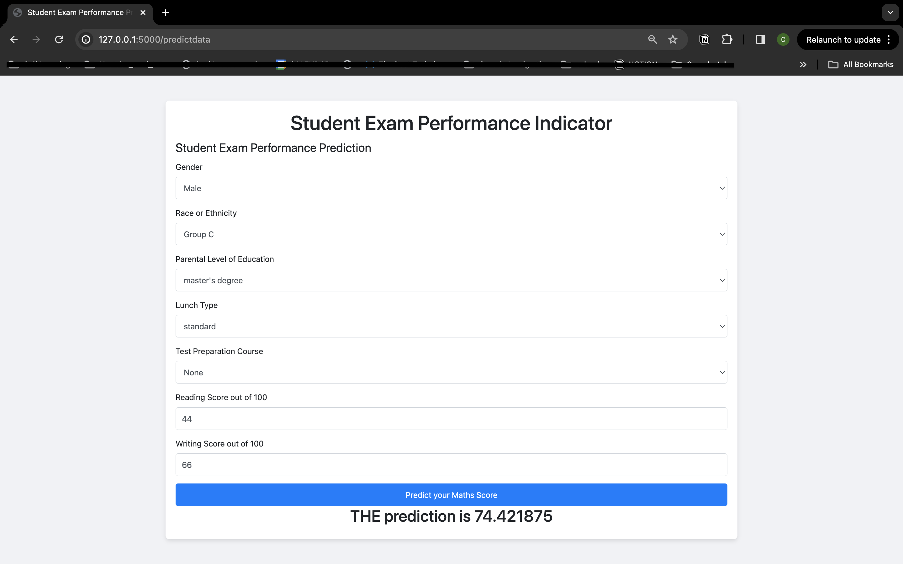

# End to End Machine Learing Project

# MLOps Project Setup Guide

This guide outlines the setup process for our MLOps project, including environment setup, project structure, and common functionalities.

## Environment Setup

1. **Creating a New Environment:**
   - Create a new repository on GitHub and name it appropriately.
   - Locally, create a new project folder.
   - Open the project folder using an IDE like Visual Studio Code.
   - Create a virtual environment with Python 3.8: `conda create -p venv python==3.8 -y`.
   - Activate the virtual environment: `conda activate`.
   - Synchronize the remote GitHub repository with your IDE project:
     - Initialize Git, create a README.md locally, add files to staging, commit, create branches, and push changes to GitHub.
     - On GitHub, create a `.gitignore` file.
     - Pull changes to your IDE using Git.

2. **Setup.py:**
   - A Python script ensuring correct installation of the program as a package, enabling its distribution via PyPI.
   - After `setup.py`, ensure the `src` folder is created and recognized as a package.

3. **Requirements.txt:** List all project dependencies here.

## Project Structure

1. **Src Folder:** Development hub of the project, identified as a package by `__init__.py` files.

2. **Components Folder:** Contains modules like data ingestion, data transformation, and model training, including functionality to push the trained model file to the cloud. It's made importable by including an `__init__.py` file.

3. **Pipeline Folder:** Houses training and prediction pipelines.

4. **Logger File:** For logging all execution information, helping track errors or exceptions.

5. **Exception File:** Handles exceptions, utilizing the sys library to interact with the Python runtime environment.

6. **Utils File:** Contains common functions used throughout the project, such as reading data from clouds or pushing `.pkl` files to the cloud.

Remember to replace placeholders with your specific details, and adjust the structure as necessary for your project.

## Project Structure Enhancement
1. **Notebooks Folder: :** 
Create a notebooks folder at the root level to contain Jupyter notebooks.

- EDA Student Performance.ipynb for exploratory data analysis.
- Model Training.ipynb for training the model on your dataset.

2. **Components Folder:** 
- Data Ingestion: Read data, split into train/test sets, save them into the designated data_path.
- Data Transformation: Implement preprocessing for different data types.
- Model Trainer: Iterate through multiple algorithms, perform hyperparameter tuning with grid search, and save the best model.

3. **New Files for Prediction Pipeline:** 
- predict_pipeline.py: Script to load preprocessing and model files to make predictions.
- app.py: Flask application to serve predictions. It should handle both 'GET' for form rendering and 'POST' for processing requests and returning predictions.
## Additional Steps
1. **Exploratory Data Analysis (EDA):**

- Perform detailed EDA to understand the dataset better. Visualize data distributions, correlations, and other relevant statistics.
2. **Model Training:**

- Detailed steps in Model Training.ipynb for training the model, including feature selection, model evaluation, and saving the best-performing model.
3. **Creating a Prediction Pipeline:**

- Develop a Flask web app that can receive input features through a web form or API call, process them using the saved preprocessor and model, and return predictions.
4. **Deployment:**

- Consider deploying your Flask app to a cloud platform such as Heroku, AWS, or GCP for public accessibility.

